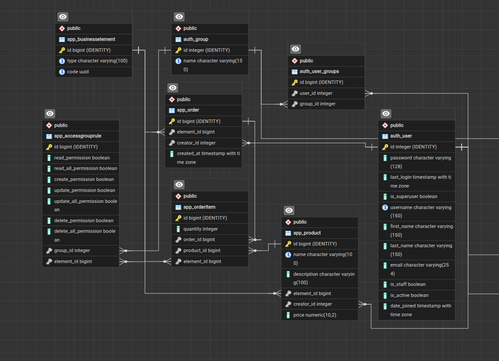
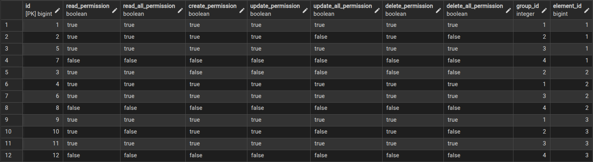

# AuthDRF

API backend-приложение – для создания заявок и продуктов; разграничение прав доступа через групповые политики (основываясь на архитектуру RBAC) к элементам бизнес логики; аутентификация/авторизация пользователя.

## Требования

- **Python**: 3.12+
  - Django==6.0.5
  - drf_yasg==1.21.15
  - djangorestframework==3.17.1
  - djangorestframework_simplejwt==5.5.1
  - psycopg2-binary==2.9.11
- **Docker**: 29.5.0+ (опционально)
- **Postgres**: 18.0+ (опиционально, контейнер добавлен в docker-compose.yaml)


## Структура проекта

```
.
├── pet_project
│   ├── __init__.py
│   ├── app
│   │   ├── admin.py
│   │   ├── apps.py
│   │   ├── __init__.py
│   │   ├── migrations
│   │   ├── models.py
│   │   ├── permissions.py       # кастомные ограничения для представлений
│   │   ├── serializers.py
│   │   ├── tests.py
│   │   └── views.py
│   ├── asgi.py
│   ├── settings.py
│   ├── urls.py
│   └── wsgi.py
├── docker-compose.yaml
├── Dockerfile
├── docker-compose.yaml          # дамп с тестовыми данными
├── entrypoint.sh
├── manage.py
├── AccessGroupRule.png          # права доступа к конкретному элементу через API
├── ERD.png                      # схема связей ERD
├── pg_hba.conf 
├── README.md
├── requirements.in
└── requirements.txt
```

## Установка и запуск (локально)

```bash
cd NAME_PROJECT # в той директории, где у вас хранится проект
pip install -r requirements.txt

# ВАЖНО. предварительно у вас должен быть установлен сервер Postgres.
# Иначе измените данные в settings.DATABASES, для вашего сервера Postgres
# либо другого сервера БД (MySql, SQLite и т.д.)
python3 manage.py runserver 8000
```

## Запуск в Docker

```bash
# Предварительно настроить переменные окружения в .env для гибкого управления
docker compose up -d 

# Загрузить дамп в базу
docker exec -i NAME_CONTAINER psql -U postgres test < dump.sql

# Выгрузить дамп из базы
# docker exec -t NAME_CONTAINER pg_dump -U postgres test > dump.sql
```

## Конфигурация

Настройка через переменные окружения. Обязательные для продакшена:

| Переменная                    | Описание                                           |
| ----------------------------- | -------------------------------------------------- |
| `DJANGO_HOST`                 | IP адрес для подсети в Docker                      |
| `DJANGO_PORT`                 | Порт для доступа к API (установка для TCP сокета)  |
| `DB_HOST`                     | IP адрес для доступа к локальной/внейшей БД        |
| `DB_PORT`                     | Порт для доступа к БД (установка для TCP сокета)   |
| `DB_USER`                     | Имя для доступа к БД                               |
| `DB_PASSWORD`                 | Пароль для доступа к БД                            |
| `DB_NAME`                     | Cхема БД                                           |
| ----------------------------- | -------------------------------------------------- |

## Структура доступа

Url для доступа к API:

- http://127.0.0.1:8001/swagger/ - предпочтение
- http://127.0.0.1:8001/redoc/
- http://127.0.0.1:8001/

Cхема связей ERD:


Есть 4 группы, для которых создаются ограничения доступа к определенным элементам бизнес логики:

- ***admin*** (group_id: 1) -> администратор

- ***user*** (group_id: 2) -> пользователь

- ***manager*** (igroup_id: 3) -> управляющий

- ***guest*** (group_id: 4) -> гость (новый пользователь)

Таблица прав к определнному элементу бизнес логики:


Есть 3 элемента бизнес логики: 

- ***order*** (element_id: 1) -> заказ, который был создан кем-то

- ***product*** (element_id: 2) -> продукт, который может быть включен в заказ

- ***orderItem*** (element_id: 3) -> элемент-связка заказ + продукт

Для каждого элемента есть групповые ограничения на CRUD операции.
